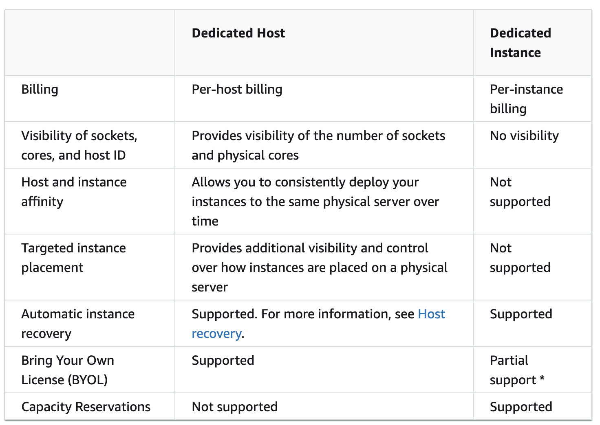

**Amazon EC2 Dedicated Host** is the physical server with EC2 instance capacity fully dedicated to your use. Dedicated Hosts allow you to use your existing per-socket, per-core, or per-VM software licenses, including Windows Server, Microsoft SQL Server, SUSE, and Linux Enterprise Server.

### Dedicated Host vs Dedicated Instance
