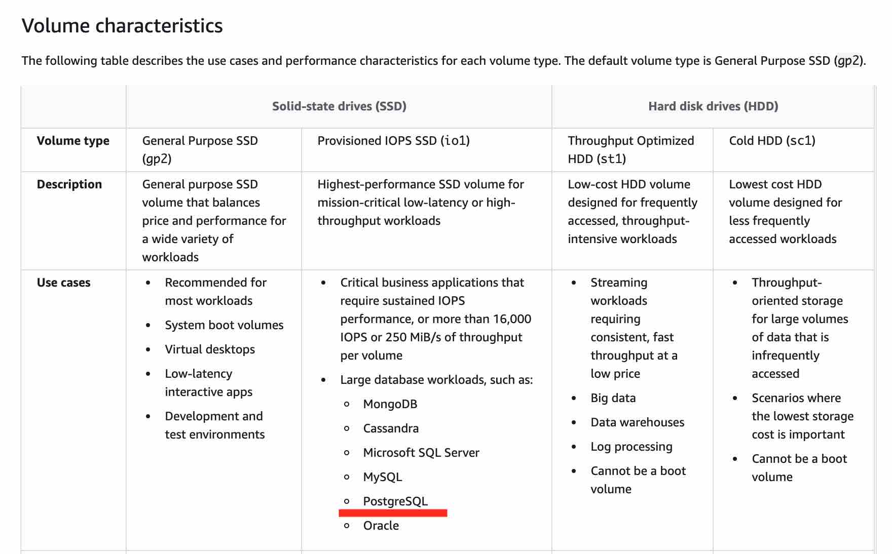

# Features of Amazon EBS
* You create an EBS volume in a specific Availability Zone, and then attach it to an instance in that same Availability Zone. To make a volume available outside of the Availability Zone, you can create a snapshot and restore that snapshot to a new volume anywhere in that Region.
* Amazon EBS provides the following volume types: 
    * General Purpose SSD
    * Provisioned IOPS SSD
    * Throughput Optimized HDD
    * Cold HDD

# Amazon EBS volumes
* An Amazon EBS volume is a durable, block-level storage device that you can attach to your instances. After you attach a volume to an instance, you can use it as you would use a physical hard drive
* You can attach multiple EBS volumes to a single instance. The volume and instance must be in the same Availability Zone. 

# Amazon EBS snapshots
## Encryption
* Snapshots of encrypted volumes are automatically encrypted.
* Volumes that you create from encrypted snapshots are automatically encrypted.
* Volumes that you create from an unencrypted snapshot that you own or have access to can be encrypted on-the-fly.
* When you copy an unencrypted snapshot that you own, you can encrypt it during the copy process.
* When you copy an encrypted snapshot that you own or have access to, you can reencrypt it with a different key during the copy process.
* The first snapshot you take of an encrypted volume that has been created from an unencrypted snapshot is always a full snapshot.
* The first snapshot you take of a reencrypted volume, which has a different CMK compared to the source snapshot, is always a full snapshot. 

# EBS Volume Types
