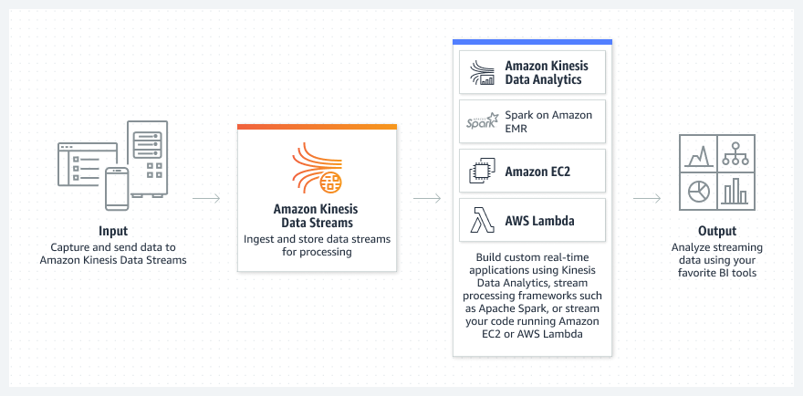

# Architecture

# Features

**Kinesis Data Streams** supports changes to the data record retention period of your stream. A Kinesis data stream is an ordered sequence of data records meant to be written to and read from in real-time. Data records are therefore stored in shards in your stream temporarily.

The time period from when a record is added to when it is no longer accessible is called the retention period. A Kinesis data stream stores records from ***24 hours*** by default to a maximum of 8760 hours (365 days).