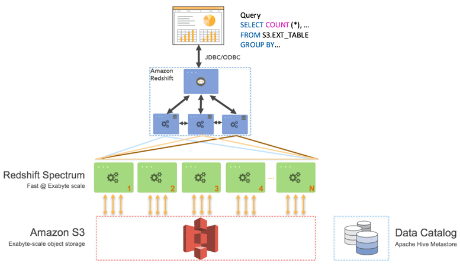

**Amazon Redshift** is a fully-managed petabyte-scale cloud-based data warehouse product designed for large scale data set storage and analysis.

Using **Amazon Redshift Spectrum**, you can efficiently query and retrieve structured and semistructured data from files in Amazon S3 without having to load the data into Amazon Redshift tables.

**Amazon Redshift Spectrum** resides on dedicated Amazon Redshift servers that are independent of your cluster. Redshift Spectrum pushes many compute-intensive tasks, such as predicate filtering and aggregation, down to the Redshift Spectrum layer. Thus, Amazon Redshift Spectrum queries use much less of your cluster's processing capacity than other queries.

