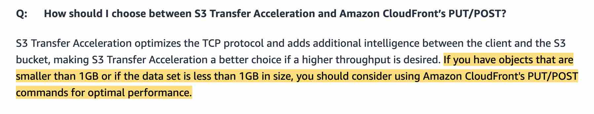

1. Usecase for S3 Transfer Acceleration and Amazon Cloudfront

2. Encrypt object
To encrypt an object at the time of upload, you need to add a header called *x-amz-server-side-encryption* to the request to tell S3 to encrypt the object using SSE-C, SSE-S3, or SSE-KMS.