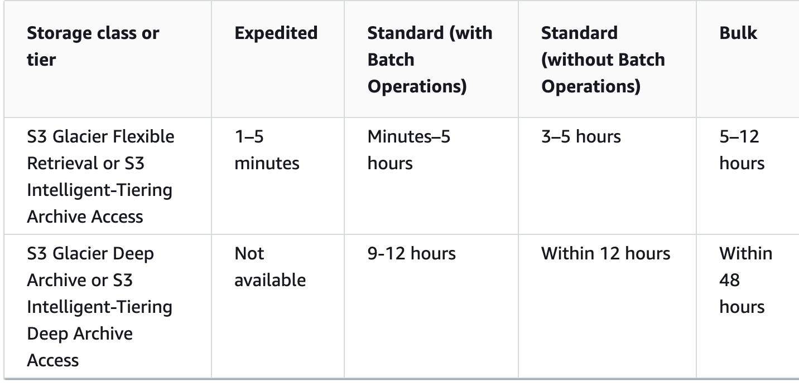

# Archive retrieval options

* **Expedited** – Quickly access your data that is stored in the S3 Glacier Flexible Retrieval storage class or S3 Intelligent-Tiering Archive Access tier. 
* **Standard** - Access any of your archived objects within several hours. Standard is the default option for retrieval requests that do not specify the retrieval option.
* **Bulk** – Access your data by using the lowest-cost retrieval option in Amazon S3 Glacier. With Bulk retrievals, you can retrieve large amounts, even petabytes, of data inexpensively.

