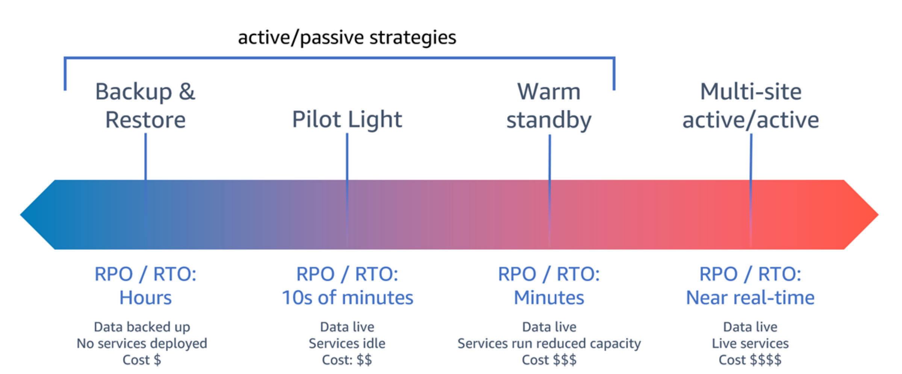

# Disaster Recovery Objects (DR)
* **Recovery Time Objective** (RTO) Defined by the organization. RTO is the maximum acceptable delay between the interruption of service and restoration of service. This determines what is considered an acceptable time window when service is unavailable.

* **Recovery Point Objective** (RPO) Defined by the organization. RPO is the maximum acceptable amount of time since the last data recovery point. This determines what is considered an acceptable loss of data between the last recovery point and the interruption of service.

# DR mechanisms
**Backup and restore**

* Back up your data and applications into the recovery Region. Using automated or continuous backups will permit point in time recovery (PITR), which can lower RPO to as low as 5 minutes in some cases. 
* In the event of a disaster, you will deploy your infrastructure (using infrastructure as code to reduce RTO), deploy your code, and restore the backed-up data to recover from a disaster in the recovery Region.

**Plot Light**

* Provision a copy of your core workload infrastructure in the recovery Region. 
* Replicate your data into the recovery Region and create backups of it there. 
* Resources required to support data replication and backup, such as databases and object storage, are always on.

**Warm standby**

* Maintain a scaled-down but fully functional version of your workload always running in the recovery Region. 
* Business-critical systems are fully duplicated and are always on, but with a scaled down fleet. 
* Data is replicated and live in the recovery Region. 
* When the time comes for recovery, the system is scaled up quickly to handle the production load.

**Multi-site**

* Your workload is deployed to, and actively serving traffic from, multiple AWS Regions. 
* This strategy requires you to synchronize data across Regions. 
* Possible conflicts caused by writes to the same record in two different regional replicas must be avoided or handled, which can be complex.

# Comparision DR mechanism

|Mechanism | RPO| RTO |
|----------|----------|----------|
| Backup and Restore | Hours | < 24 hours |
| Plot Light | Minutes | 10 minutes |
| Warm Standby | Seconds | Minutes |
| Multi-site | Near zero | potentially zero |

**Summary**
