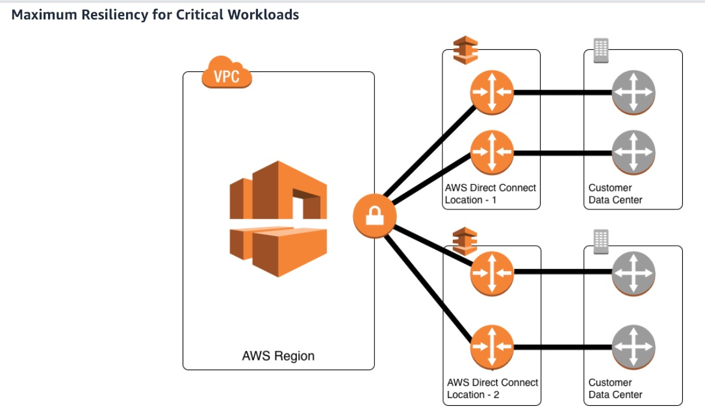

**Question** 
To support critical production workloads that require maximum resiliency, a company wants to configure network connections between its Amazon VPC and the on-premises infrastructure. The company needs AWS Direct Connect connections with speeds greater than 1 Gbps.
As a solutions architect, which of the following will you suggest as the best architecture for this requirement?

A. Opt for one AWS Direct Connect connection at each of the multiple Direct Connect locations

B. Opt for at least two AWS Direct Connect connections terminating on different devices at a single Direct Connect location

**C. Opt for two separate AWS Direct Connect connections terminating on separate devices in more than one Direct Connect location**

D. Use AWS Managed VPN as a backup for AWS Direct Connect connections to ensure maximum resiliency

**Explained**

Maximum resilience is achieved by separate connections terminating on separate devices in more than one location. This configuration offers customers maximum resilience to failure. As shown in the figure above, such a topology provides resilience to device failure, connectivity failure, and complete location failure. You can use Direct Connect Gateway to access any AWS Region (except AWS Regions in China) from any AWS Direct Connect locations.

Maximum Resiliency for Critical Workloads:
